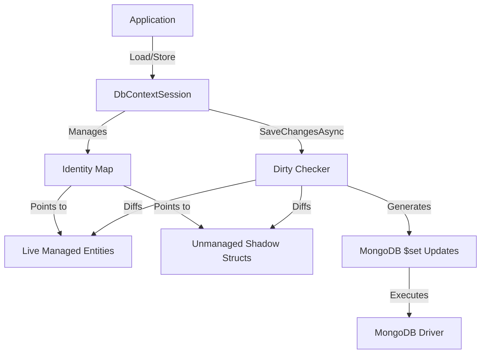
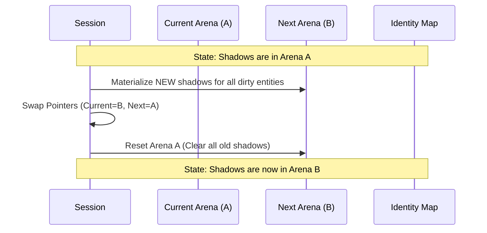
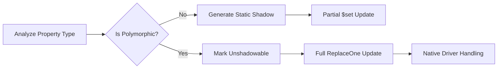

# MongoZen Persistence Wiki

This document provides a comprehensive overview of the MongoZen persistence layer, covering architectural design, technical implementation details, and edge-case handling.

---

## Part 1: Technical Deep-Dive

MongoZen achieves near-zero allocation persistence using unmanaged memory and source generation.

### 1.1 High-Level Architecture

MongoZen sits between your application logic and the MongoDB C# Driver. It uses a **Unit of Work** pattern implemented via `DbContextSession`. The key differentiator is the **Identity Map** which doesn't just store object references, but also "shadow" copies of your data in unmanaged memory.

### 1.2 The Dirty-Checking Flow

When you load an entity, MongoZen's source-generated code "materializes" a bit-for-bit copy of that entity's database-mapped properties into an unmanaged `ArenaAllocator`.

1.  **Tracking**: On load, a shadow struct is allocated. Strings are cloned into the arena as raw byte buffers (`ArenaString`). Collections are cloned as `ArenaList<T>`.
2.  **Comparison**: During `SaveChangesAsync`, the library iterates through the Identity Map. It passes the pointer to the shadow struct and the reference to the live entity to a source-generated `IsDirty` method.
3.  **Extraction**: If dirty, the generated `ExtractChanges` method performs a property-by-property comparison to build a MongoDB `UpdateDefinition`.

### 1.3 Double-Buffering & Memory Lifecycle

To prevent unmanaged memory leaks while maintaining high performance, MongoZen employs a double-buffering strategy for its `ArenaAllocator`. This is critical because every save cycle generates a fresh set of shadows to represent the new "baseline" state.

#### The Swap Cycle

*   **Generation Counter**: Each arena swap increments a generation counter.
*   **ShadowPtr Safety**: Shadow pointers are wrapped in a `ShadowPtr` struct. In debug builds, this struct stores the generation ID. Any attempt to dereference a pointer from an old generation results in an immediate safety exception.

### 1.4 O(1) Dictionary Tracking

Dictionaries are a major bottleneck in traditional tracking systems. MongoZen solves this by using a custom unmanaged hash map.

1.  **Hashing**: `ArenaString` uses `XxHash3` (non-cryptographic, ultra-fast) on the raw underlying bytes.
2.  **Lookup**: When checking if a dictionary is dirty, the system performs an O(1) lookup into the `ArenaDictionary` using the managed string key directly.
3.  **No Allocation**: The lookup avoids converting the managed `string` into an `ArenaString` or `byte[]` on the heap, keeping the hot-path allocation-free.

### 1.5 Include Interception (`_included_`)

To eliminate GC pressure during complex `$lookup` queries, MongoZen uses a custom `IncludeWrappingSerializer`.

1.  **Raw Streaming**: It deserializes the results as `RawBsonDocument` (a shallow wrapper around the raw byte buffer).
2.  **Interception**: It scans the buffer for keys prefixed with `_included_`.
3.  **Sideloader**: It pulls the joined entities out and places them directly into the Session's Identity Map before the main entity is even fully deserialized.
4.  **Shadow Clean-up**: It provides a filtered view of the BSON to the standard class serializer, effectively "hiding" the join data so the main entity remains clean.

---

## Part 2: Edge Cases & Design Decisions

### 2.1 Partial Updates vs. Full Replacements

#### Primitives and Strings
For simple fields (int, bool, string, etc.), the system uses `$set` to update only the modified field. This minimizes network I/O and reduces the chance of write conflicts.

#### Collections and Dictionaries
When a `List<T>`, `T[]`, or `Dictionary<K, V>` is modified, MongoZen replaces the **entire collection** using a single `$set` operation.
*   **Rationale**: Calculating a positional diff for arrays (e.g., `$set: { "Items.2": val }`) is computationally expensive and unsafe in concurrent environments where array indexes might shift.
*   **Safety**: Replacing the entire collection ensures the database precisely matches the in-memory state.

### 2.2 Polymorphism & Discriminators (`_t`)

If a property is of an abstract type, an interface, or has `[BsonKnownTypes]`, it is considered **unshadowable**.

*   **Handling**: The source generator identifies these types and intentionally triggers a fallback to `ReplaceOne` (full document replacement).
*   **Rationale**: This allows the official MongoDB C# Driver to perform native serialization. The driver correctly handles runtime type inspection, writes the necessary `_t` discriminator fields, and serializes derived properties that the static shadow state could not have known about.

---

## Part 3: Best Practices for Entities

### Use Materialized Collections
Avoid using `IEnumerable<T>` for properties mapped to the database.
*   **Why**: The dirty-checking logic must enumerate the collection to compare it against the shadow. If the property is a lazy LINQ query, it will be executed multiple times (once for the count, once for comparison, and once by the MongoDB driver for serialization), leading to severe performance degradation.
*   **Recommended**: Use `List<T>`, `HashSet<T>`, or arrays.

### Avoid Unshadowable Types on the Hot Path
While polymorphism is fully supported via the `ReplaceOne` fallback, frequent updates to polymorphic properties will bypass the `$set` optimization. For maximum performance in highly concurrent systems, prefer flat, concrete entity structures where possible.
